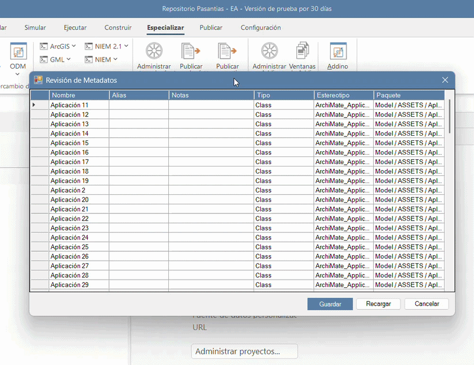

# Desafío Técnico — Sparx Enterprise Architect + Prolaborate

Este repositorio contiene mi resolución del **Desafío Técnico de Práctica de Proagile 2026**, orientado a la construcción y explotación de soluciones sobre **Sparx Enterprise Architect** y **Prolaborate**.

El desafío se dividió en dos ejercicios complementarios:

- **Ejercicio 1:** desarrollo de un Add-in en C# para revisar y modificar metadatos directamente desde Enterprise Architect.
- **Ejercicio 2:** construcción de consultas SQL sobre el repositorio de EA para obtener información de gobierno, vigencia y análisis de impacto.

Además de los requisitos obligatorios, implementé varios de los puntos opcionales propuestos en ambos ejercicios.

<p align="center">
  
</p>
---

## Estructura del repositorio

```text
.
├── Exercise_1_Addin/
│   ├── docs/
│   ├── Properties/
│   ├── Addino.sln
│   ├── Addino.csproj
│   ├── AddinoClass.cs
│   ├── MetadataElementRow.cs
│   ├── MetadataReviewForm.cs
│   └── MetadataReviewForm.Designer.cs
│
├── Exercise_2_queries/
│   ├── docs/
│   ├── queries/
│   └── Pino_Ejercicio_2_Informe_Principal_Queries_EA.pdf
│
└── openspec/
    ├── specs/
    └── changes/
        └── archive/
```

La documentación de cada ejercicio se mantiene junto a su implementación.  
Los artefactos de desarrollo SDD/OpenSpec quedaron preservados dentro de `openspec/changes/archive/` una vez finalizados y verificados los cambios.

---

# Ejercicio 1 — Add-in para Enterprise Architect

El primer ejercicio consistió en desarrollar un complemento para Enterprise Architect que permitiera **revisar y corregir metadatos de elementos sin tener que abrirlos individualmente**.

La solución fue desarrollada en:

- C#
- .NET Framework 4.7.2
- Windows Forms
- Interop.EA
- COM
- Visual Studio
- Enterprise Architect x64

El Add-in se integra directamente dentro de EA y puede ejecutarse desde:

```text
Especializar → Addino → Revisión de Metadatos de Elementos
```

## Funcionamiento

Al seleccionar un paquete, Addino abre una ventana que permite trabajar con los siguientes datos:

| Campo | Comportamiento |
|---|---|
| Nombre | Editable |
| Alias | Editable |
| Notas | Editable |
| Tipo | Solo lectura |
| Estereotipo | Solo lectura |
| Paquete | Solo lectura |

Los cambios se realizan primero de forma local. Enterprise Architect solamente es modificado cuando el usuario presiona **Guardar**.

Esto permite editar varios elementos y decidir posteriormente si los cambios deben persistirse o descartarse.

## Extensiones opcionales implementadas

Además del alcance obligatorio, amplié Addino con varias mejoras.

### Carga recursiva

El paquete seleccionado funciona como raíz de la revisión.

Addino carga:

- los elementos contenidos directamente en el paquete;
- los elementos de sus subpaquetes;
- los elementos existentes en niveles más profundos de la jerarquía.

La columna **Paquete** permite identificar rápidamente de dónde proviene cada elemento.

El recorrido también incorpora protección frente a paquetes o elementos repetidos para evitar duplicados o recorridos innecesarios.

### Validación de Nombre

Antes de realizar cualquier actualización, Addino valida globalmente las filas modificadas.

Si un elemento tiene un `Name` vacío o compuesto únicamente por espacios:

- se bloquea el guardado completo;
- no se ejecuta ningún `Element.Update()`;
- se identifica visualmente el campo inválido;
- el usuario puede corregirlo sin perder el resto de sus modificaciones.

### Seguimiento de cambios

Cada fila mantiene una referencia de sus valores originales.

Cuando se modifica `Nombre`, `Alias` o `Notas`, la fila queda resaltada como cambio pendiente.

Si el usuario vuelve exactamente al valor original, el indicador desaparece automáticamente.

Después de un guardado exitoso, los valores persistidos pasan a ser la nueva línea base.

### Guardar

Guardar procesa únicamente las filas que realmente fueron modificadas.

Cada elemento se recupera desde el repositorio mediante su identificador y se actualiza utilizando la API de Enterprise Architect.

Los posibles errores se manejan por fila, permitiendo que una falla puntual no interrumpa necesariamente el procesamiento de las restantes.

### Recargar

También incorporé la posibilidad de volver a consultar el repositorio sin cerrar Addino.

Si no existen modificaciones pendientes, la recarga se realiza inmediatamente.

Si hay cambios sin guardar, se solicita confirmación:

- **Sí:** descarta los cambios locales y vuelve a cargar los datos desde EA.
- **No:** cancela la recarga y conserva exactamente el estado actual.

`Recargar` nunca ejecuta un guardado implícito.

### Cancelar

Los cambios también pueden descartarse mediante:

- **Cancelar**
- `Esc`
- la `X` de la ventana

Ninguna de estas acciones persiste modificaciones.

---

## Arquitectura

Intenté mantener la solución pequeña y fácil de seguir, separando las responsabilidades principales en tres componentes:

### `AddinoClass`

Responsable de la integración con Enterprise Architect:

- callbacks COM;
- menú del Add-in;
- validación de la selección;
- acceso al repositorio;
- carga del paquete y sus descendientes.

### `MetadataElementRow`

Representa localmente cada elemento mostrado en la grilla.

Mantiene:

- identificador del elemento;
- metadatos editables;
- valores originales;
- ruta del paquete;
- estado de modificación.

La interfaz no necesita mantener referencias COM de larga duración hacia `EA.Element`.

### `MetadataReviewForm`

Contiene la interfaz y el comportamiento de usuario:

- edición;
- validación;
- Guardar;
- Recargar;
- Cancelar;
- indicadores visuales;
- manejo de errores.

---

## Documentación del Ejercicio 1

- [Solución Visual Studio](Exercise_1_Addin/Addino.sln)
- [Informe principal](Exercise_1_Addin/Pino_Ejercicio_1_Informe_Principal_Addin.pdf)
- [Guía de ejecución](Exercise_1_Addin/Pino_Guia_Ejecucion_Addino.pdf)
- [Evidencias funcionales](Exercise_1_Addin/docs/Pino_Evidencias_Pruebas_Funcionales_Addino.pdf)
- [Registro de Uso de IA](Exercise_1_Addin/docs/Pino_Registro_Uso_IA_Ejercicio_1.pdf)
- [AI Usage Log](Exercise_1_Addin/docs/Pino_AI_USAGE_LOG.md)

---

# Ejercicio 2 — Queries sobre el repositorio de Enterprise Architect

El segundo ejercicio se enfocó en entender la estructura interna del repositorio de Enterprise Architect y utilizar SQL para responder preguntas concretas de gobierno de aplicaciones.

El archivo principal de consultas es:

[`Pino_Exercise_2_EA_Governance_Queries.sql`](Exercise_2_queries/queries/Pino_Exercise_2_EA_Governance_Queries.sql)

Decidí separar los resultados agregados de los listados de elementos, por lo que finalmente desarrollé **cinco consultas**:

| ID | Objetivo |
|---|---|
| Q1-C | Cantidad de aplicaciones con `Categoria = ORO` |
| Q1-L | Listado de aplicaciones con `Categoria = ORO` |
| Q2-G | Cantidad de aplicaciones agrupadas por `Vigencia` |
| Q3-C | Cantidad de aplicaciones afectadas por Base de Datos 28 |
| Q3-L | Listado de aplicaciones afectadas por Base de Datos 28 |

Todas las consultas son exclusivamente de lectura.

---

## Tablas utilizadas

Las consultas trabajan principalmente con tres tablas del repositorio EA:

### `t_object`

Contiene los elementos del modelo.

Para identificar aplicaciones utilicé:

```sql
Object_Type = 'Class'
AND Stereotype = 'ArchiMate_ApplicationComponent'
```

### `t_objectproperties`

Contiene los Tagged Values.

Desde esta tabla se obtienen:

- `Categoria`
- `Vigencia`

### `t_connector`

Contiene las relaciones entre elementos y se utiliza para el análisis de impacto sobre **Base de Datos 28**.

---

## Resultados obtenidos

### Categoría ORO

Se identificaron:

**8 aplicaciones**

correspondientes a:

```text
Aplicación 1
Aplicación 2
Aplicación 3
Aplicación 4
Aplicación 6
Aplicación 8
Aplicación 20
Aplicación 29
```

La consulta de listado incorpora `CLASSGUID` y `CLASSTYPE`, permitiendo navegar desde el resultado de SQL Search hacia el elemento real dentro de Enterprise Architect.

### Vigencia

La distribución obtenida fue:

| Estado | Cantidad |
|---|---:|
| Vigente | 16 |
| Deprecado | 14 |

Antes de cerrar la consulta también verifiqué la existencia de valores vacíos, `NULL`, `N/A` o valores conflictivos para el Tagged Value `Vigencia`.

En el repositorio utilizado no se encontraron casos de ese tipo.

### Impacto sobre Base de Datos 28

La tercera consulta analiza dependencias donde:

```text
Aplicación → Base de Datos 28
```

Se identificaron **5 aplicaciones afectadas**:

```text
Aplicación 5
Aplicación 12
Aplicación 22
Aplicación 25
Aplicación 27
```

La dirección se determina mediante:

```text
Start_Object_ID → aplicación origen
End_Object_ID   → Base de Datos 28
```

Durante el análisis aparecieron también relaciones desde:

```text
Servidor 2
Servidor 5
Servidor 19
```

Estos elementos fueron utilizados como control negativo y quedaron correctamente excluidos al no cumplir el criterio de aplicación.

También validé desde Enterprise Architect que los elementos obtenidos poseyeran realmente la relación de dependencia esperada.

---

## Validación de las consultas

Utilicé dos mecanismos diferentes durante el desarrollo.

### SQLite

El archivo `.qea` fue inspeccionado mediante SQLite exclusivamente en modo **read-only**.

Lo utilicé como herramienta diagnóstica para:

- estudiar la estructura de las tablas;
- verificar cantidades;
- detectar valores faltantes;
- comprobar duplicados;
- estudiar relaciones.

### Enterprise Architect SQL Search

La validación definitiva se realizó manualmente en **Enterprise Architect**.

Cada una de las cinco consultas fue ejecutada individualmente y comparada contra los elementos, Tagged Values y relaciones visibles en el modelo.

Por este motivo, los resultados de EA fueron considerados la evidencia funcional principal y SQLite quedó únicamente como mecanismo de comprobación secundaria.

---

# Prolaborate

Como punto opcional del Ejercicio 2, llevé la información de **Vigencia** a un dashboard en Prolaborate.

El dashboard creado fue:

**Gobierno de Aplicaciones - Pasantías - Pino**

Tomé Q2-G como referencia funcional:

```text
Vigente   = 16
Deprecado = 14
```

La ejecución directa de la consulta devolvía correctamente esos resultados, aunque para la representación gráfica Prolaborate necesitaba una estructura orientada a series.

Finalmente utilicé el Designer manteniendo exactamente el mismo criterio funcional:

- elemento: Application Component;
- Tagged Value: `Vigencia`;
- valores: `Vigente` y `Deprecado`.

Se generaron dos visualizaciones:

### Gráfico de dona

```text
Vigente   53,33 %
Deprecado 46,67 %
```

### Gráfico de barras

```text
Vigente   16
Deprecado 14
```

Los valores coinciden con los obtenidos previamente en Enterprise Architect.

La documentación de esta parte se encuentra en:

[Pino_Exercise_2_Prolaborate_Q2.md](Exercise_2_queries/docs/Pino_Exercise_2_Prolaborate_Q2.md)

---

## Documentación del Ejercicio 2

- [Informe principal](Exercise_2_queries/Pino_Ejercicio_2_Informe_Principal_Queries_EA.pdf)
- [Queries SQL](Exercise_2_queries/queries/Pino_Exercise_2_EA_Governance_Queries.sql)
- [Evidencias funcionales](Exercise_2_queries/docs/Pino_Evidencias_Funcionales_Queries.pdf)
- [Explicación técnica](Exercise_2_queries/docs/Pino_Exercise_2_Technical_Explainer.md)
- [Índice de evidencias](Exercise_2_queries/docs/Pino_Exercise_2_Evidence_Index.md)
- [Diagnósticos SQLite](Exercise_2_queries/docs/Pino_Exercise_2_SQLite_Diagnostics.md)
- [Documentación de Prolaborate](Exercise_2_queries/docs/Pino_Exercise_2_Prolaborate_Q2.md)
- [Registro de Uso de IA](Exercise_2_queries/docs/Pino_Registro_Uso_IA_Ejercicio_2.pdf)
- [AI Usage Log](Exercise_2_queries/docs/Pino_Exercise_2_AI_Usage_Log.md)

---

# Metodología de desarrollo

Para organizar el desarrollo utilicé un enfoque de **Specification-Driven Development (SDD)** mediante OpenSpec, Gentle-AI y OpenCode.

En lugar de implementar cada ejercicio directamente desde una única conversación, fui separando el trabajo en distintas fases:

```text
Explore
  ↓
Proposal
  ↓
Spec
  ↓
Design
  ↓
Tasks
  ↓
Apply
  ↓
Verify
  ↓
Archive
```

Esto me permitió mantener separados:

- requisitos;
- decisiones técnicas;
- diseño;
- tareas;
- implementación;
- validación;
- evidencia.

En aquellas funcionalidades que necesitaban comprobarse realmente dentro de Enterprise Architect utilicé **Human Gates**.

El agente debía detenerse y esperar mi validación antes de continuar con la siguiente fase.

Esto fue especialmente útil, por ejemplo, durante las mejoras visuales de Addino: una primera implementación no cumplió con el resultado que buscaba, por lo que fue rechazada, corregida y validada nuevamente antes de continuar.

---

## OpenSpec Archive

Una vez finalizado cada cambio, ejecuté la etapa `Archive`.

Por ese motivo, dentro de:

[`openspec/changes/archive/`](openspec/changes/archive/)

se conservan los ciclos SDD utilizados durante el proyecto:

```text
ea-metadata-review-exercise-1
ea-metadata-review-optionals-ui
ea-governance-queries-exercise-2
```

Estas carpetas estuvieron inicialmente activas dentro de `openspec/changes/`.

Después de completar su implementación y verificación fueron archivadas para conservar la trazabilidad histórica de:

```text
requisitos → decisiones → diseño → tareas → implementación → verificación
```

---

# Uso de Inteligencia Artificial

Durante el desafío utilicé Inteligencia Artificial como herramienta de apoyo para distintas tareas:

- investigación de documentación;
- análisis técnico;
- estructuración de requisitos;
- diseño;
- implementación;
- revisión;
- documentación.

El desarrollo con IA no reemplazó la validación sobre las herramientas reales.

Las decisiones finales y las pruebas que dependían del comportamiento de Enterprise Architect o Prolaborate fueron realizadas y revisadas manualmente.

Para dejar trazabilidad de este proceso preparé un **Registro de Uso de IA** para cada ejercicio, acompañado por logs Markdown con mayor detalle técnico.

---

# Estado final

Ambos ejercicios se encuentran finalizados.

### Ejercicio 1

- Add-in integrado con Enterprise Architect.
- Alcance obligatorio completo.
- Requisitos opcionales seleccionados implementados.
- Human Gates aprobados.
- Verify final aprobado.
- Change archivado.

### Ejercicio 2

- Cinco consultas finales de solo lectura.
- Q1, Q2 y Q3 validadas en Enterprise Architect.
- Evidencia funcional documentada.
- Dashboard opcional de Prolaborate completado.
- Verify final completado.
- Change archivado.

---

## Autor

**Ezequiel Pino**

Desafío Técnico de Práctica — Proagile 2026